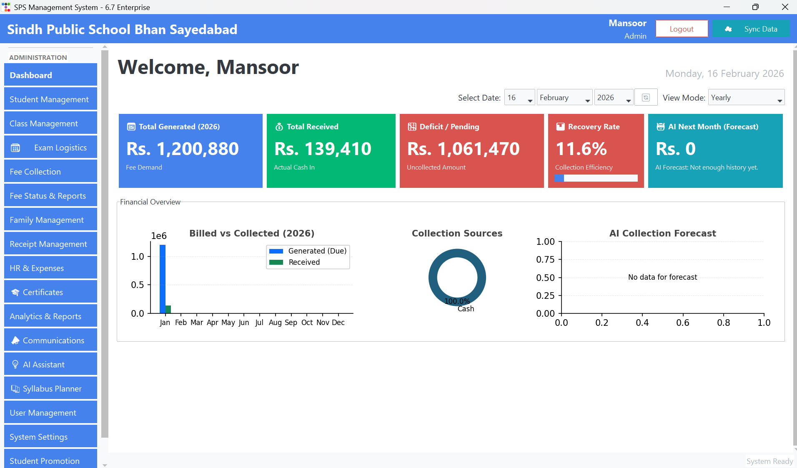
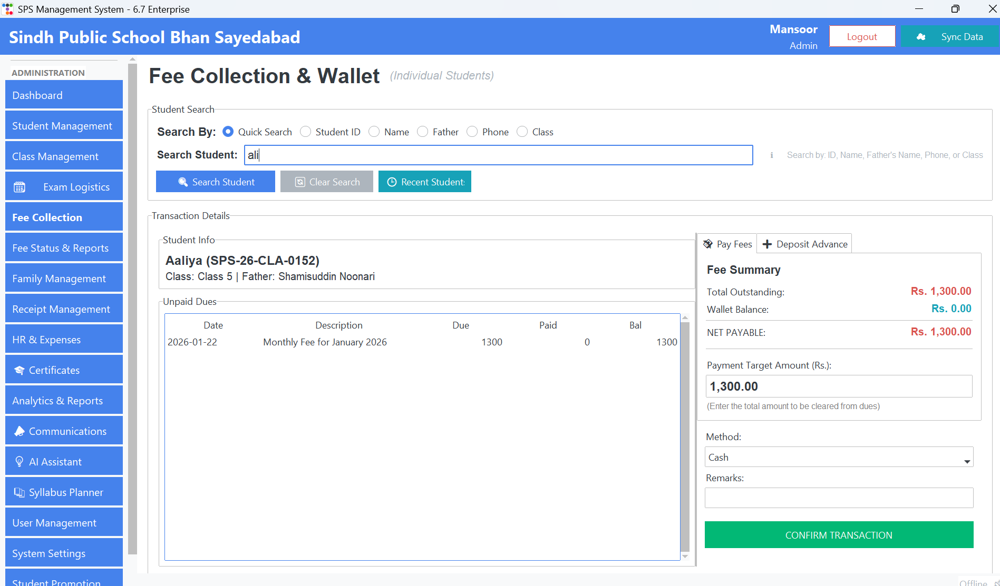
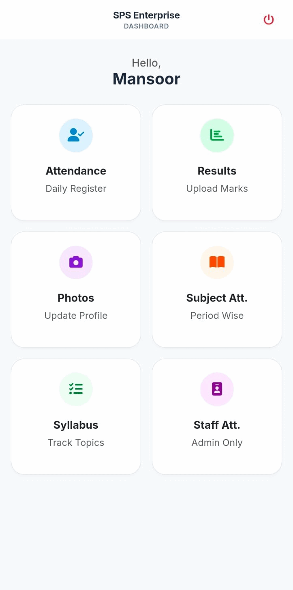

# School-Managment-System-Complete-ERP
A Hybrid Desktop-Cloud School Management Ecosystem with Offline-First Architecture &amp; Bi-Directional Sync.
# SPS Enterprise: A Hybrid School ERP Ecosystem
> **A robust, offline-first school management solution featuring bi-directional cloud synchronization, automated financial auditing, and a companion mobile app infrastructure.**

---

## 📖 About The Project

**SPS Enterprise** was born out of a specific need: Schools in regions with unstable internet connectivity need powerful software that doesn't stop working when the Wi-Fi goes down. Most web-based ERPs fail here. Desktop-only apps, however, isolate parents and teachers from real-time data.

I architected **SPS Enterprise** to bridge this gap. It is a **hybrid ecosystem** consisting of a heavy-duty Desktop Application for administrative power and a lightweight Mobile API for real-time access.

The system is built on a **"Local First, Cloud Sync"** philosophy. Administrative staff can continue collecting fees, printing thermal receipts, and managing payroll on a local SQLite database with zero latency. In the background, a custom-built synchronization engine intelligently pushes these changes to a PostgreSQL cloud cluster, ensuring the mobile app always serves fresh data.

---

## 🏗️ Architectural Highlights

This isn't just a CRUD app; it's a distributed system designed for data integrity and resilience.

### 1. The Intelligent Sync Engine (`SyncManager`)
The core innovation of this project is its bi-directional synchronization logic. Unlike simple data dumps, the system uses a transactional approach to merge data.
* **Conflict Resolution:** Handles scenarios where data is modified on both mobile and desktop simultaneously.
* **"Lifeboat" Disaster Recovery:** The system maintains a local PostgreSQL mirror. If the primary SQLite database corrupts or is deleted, the system detects the anomaly at startup and offers to "rescue" the data from the local mirror, ensuring zero data loss.
* **Optimized Bandwidth:** Uses differential updates to only upload changed records, making it viable on slow mobile hotspots.

### 2. Advanced Financial & Family Ledger
Managing school fees is complex because siblings often share accounts. I moved away from the standard "one student, one account" model.
* **Family Grouping Logic:** The system treats a "Family" as a single financial entity. A payment made by a parent automatically clears dues across multiple siblings using a waterfall algorithm (oldest dues first).
* **Zero-Transaction Detector:** An algorithmic auditing tool that scans millions of records to identify "Ghost Accounts"—students or families who haven't made a single financial interaction in a specific window, flagging them for administrative review.
* **Thermal Printing Engine:** Direct integration with GDI printers for instant, POS-style receipt generation.

### 3. Automated Academic Logistics
Manual data entry is prone to error, so I automated the heavy lifting of exam management.
* **Dynamic ID Card Generation:** Using `ReportLab`, the system programmatically draws pixel-perfect, high-resolution Student ID cards and Exam Admit Slips (with photos) directly from the database, ready for bulk printing.
* **Seating Algorithm:** The Exam Logistics module calculates seat allocation ranges automatically to prevent conflicts during exams.

---

## 📸 Feature Showcase

### The Financial Command Center

*The Fee Collection module supports partial payments, advance "wallet" deposits, and instant receipt generation. The UI is optimized for high-speed data entry, allowing cashiers to process hundreds of students per hour.*

### Real-Time Mobile Bridge

*A lightweight FastAPI server runs locally to bridge the gap between the desktop and the cloud. Teachers can mark attendance on their phones, and the data appears on the Admin's desktop screen within seconds.*

### Automated Document Generation

*No more manual design work. The system pulls student bio-data and photos to generate batch PDF files for professional printing.*

---

## 🛠️ Technology Stack

I chose a stack that prioritizes stability, speed, and ease of deployment in a Windows environment.

* **Core Application:** Python 3.10+
* **GUI Framework:** Tkinter / TTKBootstrap (Modern Flat UI)
* **Backend Databases:**
    * **SQLite:** For zero-latency, offline-first local operations.
    * **PostgreSQL:** For robust cloud storage and mobile synchronization.
* **API Layer:** FastAPI + Uvicorn (Asynchronous request handling).
* **Automation & Reports:**
    * **Selenium:** For automated WhatsApp notifications to parents.
    * **ReportLab:** For programmatic PDF generation.
    * **OpenPyXL:** For detailed financial Excel exports.
* **Security:** Hardware-ID locking (`license_manager.py`) ensures the software only runs on authorized machines.

---

## ⚠️ Proprietary Notice

*This repository serves as a portfolio showcase. The source code for **SPS Enterprise** is proprietary and developed under a commercial license. As such, the source code is not available for public use. However, I am open to discussing the architecture, the synchronization logic, and the challenges of building hybrid desktop-cloud systems.I have installed this in 2 branches of the universities and in 10 schools*

---

### 📫 Contact

Mansoor Ali
https://www.linkedin.com/in/mansoor-ali-a5a184282/
