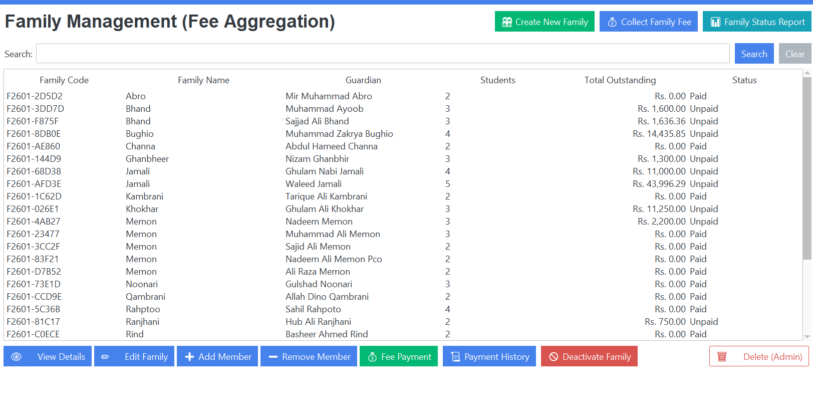
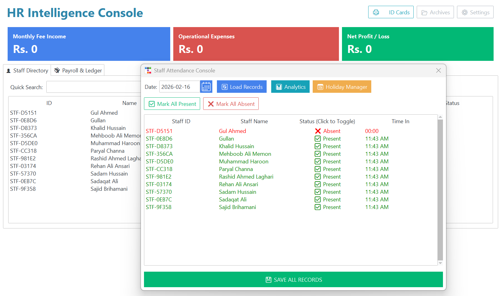
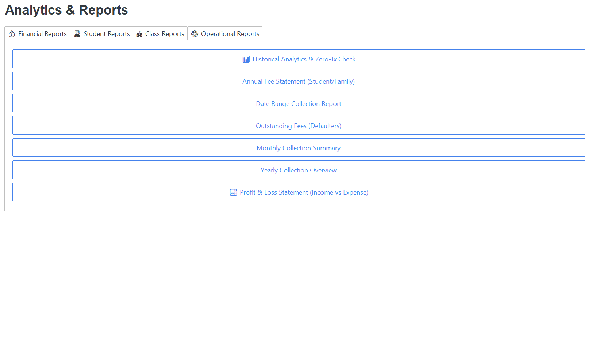

# SPS Enterprise: The Hybrid ERP for Modern Education
> **A unified School & University management ecosystem that bridges powerful desktop administration with real-time mobile freedom.**

---

## 📖 The Vision

**SPS Enterprise** isn't just software; it's the digital backbone of an educational institution. I designed it to answer a critical question: *How can schools have the heavy-duty processing power of a desktop system while giving teachers and parents the flexibility of a mobile app?*

The answer is a **Hybrid Architecture**.

SPS Enterprise seamlessly fuses a robust **Desktop Command Center** for administrators with an agile **Mobile Cloud Bridge** for staff. It delivers the best of both worlds: uncompromised performance for complex financial tasks, and instant, anywhere-access for daily operations like attendance and results. Whether the internet is blazing fast or completely down, the system keeps running, automatically synchronizing data the moment connection is restored.

**Deployment Success:** *Currently powering operations across **2 University Campuses** and **10 Schools**, handling thousands of student records and transactions every single day.*

---

## 🚀 One System, Any Institution

This financial engine is built to adapt. It effortlessly molds itself to fit the unique workflows of different educational models:

### 🎓 Universities & Colleges
* **Semester & Annual Billing:** Automatically generates fee structures based on complex academic calendars.
* **Departmental Hierarchy:** specialized management for distinct faculties (e.g., Law, Computer Science), allowing granular control over students and staff.

### 🏫 K-12 Schools
* **Monthly Fee Cycles:** Handles recurring tuition, late fines, and transport fees with zero manual effort.
* **Smart Family Grouping:** links siblings under a single guardian account, simplifying billing and communication for parents.

### 🤝 NGOs & Charity Schools
* **"NGO Mode":** A dedicated toggle that shifts the financial focus from "Billing" to "Sponsorship Tracking," ensuring every rupee of donor funding is audited without charging students.

---

## 🏗️ Engineering Highlights

### 1. The "Always-On" Sync Engine (`SyncManager`)
This is the heartbeat of the system. It ensures that data flows fluidly between the Desktop and the Cloud without user intervention.
* **Intelligent Conflict Resolution:** Smartly merges data changes from multiple sources (e.g., a fee collected at the counter vs. an attendance mark from a teacher's phone).
* **"Lifeboat" Resilience:** If the local hardware fails, the system acts as a safety net, capable of fully restoring the institutional database from the local PostgreSQL mirror.

### 2. Next-Gen Financial Management
* **Family Ledger:** We moved beyond individual accounts. A single payment from a parent intelligently clears dues across all their children, oldest to newest.
* **Zero-Transaction Detective:** An advanced algorithm that audits millions of records to pinpoint "Ghost Accounts"—students who haven't interacted financially with the school in a set period, preventing revenue leakage.

### 3. Automated Logistics & HR
* **Dynamic Document Factory:** Generates thousands of high-resolution, print-ready Student ID Cards and Exam Admit Slips (with photos) in seconds using `ReportLab`.
* **Smart HR:** Tracks staff attendance with automated "Late Entry" penalties and generates precise monthly payrolls.

---

## 📸 Experience the Interface

### The Financial Command Center

*A high-speed interface designed for cashiers. It handles everything from complex semester billing to simple monthly fees with split-payment logic.*

### Intelligent Family Management

*A unified view for administrators to manage siblings. See total family debt, collect aggregated payments, and apply group discounts in one click.*

### HR & Attendance Intelligence

*Staff management made simple. The system tracks daily check-ins, calculates deductions automatically, and prepares payroll.*

### The Real-Time Mobile Bridge

*The invisible link that keeps everything in sync. This lightweight local server pushes desktop data to the cloud, ensuring parents and teachers always see the latest information.*

### Analytics & Automation

*From instant ID card generation to deep-dive financial analytics, the system turns raw data into actionable insights.*

---

## 🛠️ The Tech Stack

Built on a foundation of stability and performance:

* **Core:** Python 3.10+ (The engine)
* **Interface:** Tkinter / TTKBootstrap (Modern, responsive Desktop UI)
* **Data Layer:**
    * **SQLite:** For lightning-fast local operations.
    * **PostgreSQL:** For robust, scalable cloud synchronization.
* **Connectivity:** FastAPI + Uvicorn (The secure bridge between Desktop and Mobile).
* **Automation Tools:**
    * **Selenium:** Powers the automated WhatsApp notification bot.
    * **ReportLab:** The engine behind pixel-perfect PDF generation.
    * **OpenPyXL:** Handles complex financial Excel reporting.

---

## ⚠️ Proprietary Notice

*This repository serves as a portfolio showcase. The source code for **SPS Enterprise** is proprietary and protected under a commercial license. While the code is not public, I am happy to walk through the system architecture, the unique synchronization challenges solved, and the design patterns used during an interview.*

---

### 📫 Let's Connect

**Mansoor Ali**
[LinkedIn Profile](https://www.linkedin.com/in/mansoor-ali-a5a184282/)
